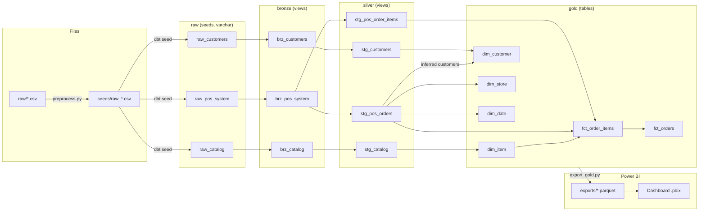

# The Daily Grind — POS Analytics Pipeline

Weekly POS CSVs → dbt on DuckDB (Bronze / Silver / Gold) → Parquet for a Power BI store-manager dashboard.

- Design decisions: [docs/project_plan.md](docs/project_plan.md)

## Case assignment tasks

| Task | Deliverable | Where to find it |
|---|---|---|
| Task 1 — Data model blueprint | Conceptual, logical and physical (star schema) model as Mermaid ER, with PKs, FKs and DuckDB types | [docs/erd.md](docs/erd.md) |
| Task 2 — Pipeline | dbt on DuckDB (Bronze / Silver / Gold), data tests, Parquet export, CI | [models/](models/), [tests/](tests/), [scripts/](scripts/), [.github/workflows/pipeline.yml](.github/workflows/pipeline.yml); how to run: [Run it](#run-it) below |
| Task 3 — Dashboard | Multi-page Power BI Store Manager dashboard on the Gold tables | Report: [UPM Case Assignment_Report.pbix](UPM%20Case%20Assignment_Report.pbix); user guide and metric definitions: [docs/dashboard_guide.md](docs/dashboard_guide.md) |

## AI workflow: blueprint, prompts and skills

| What | Where |
|---|---|
| Overall plan, confirmed decisions, model-per-task orchestration | [docs/project_plan.md](docs/project_plan.md) (§1 deliverables, §3 decisions, §9 task list with model and effort per task) |
| Task 1 implementation blueprint (step-by-step plan given to the implementing model) | [docs/superpowers/plans/task1-blueprint.md](docs/superpowers/plans/task1-blueprint.md) |
| Task 2 implementation blueprint | [docs/superpowers/plans/task2-pipeline.md](docs/superpowers/plans/task2-pipeline.md) |
| Standing prompt / rules for every model (working style, layering, validation, git) | [CLAUDE.md](CLAUDE.md) |
| Per-task subagent prompts (`*-brief.md`), their reports (`*-report.md`), branch review and progress log | `.superpowers/sdd/` — local only, excluded by `.gitignore` |

Skills used:

- **Superpowers** (Claude Code plugin): the blueprints above are written for `subagent-driven-development` (or `executing-plans`), which executes them task by task with a review after each task (named in the header of each blueprint).
- **Data-platform skills**, adapted into the rules in [CLAUDE.md](CLAUDE.md): `migrate-bi-sql-to-dbt` (contract-first models, logic in the lowest owning layer), `validate-dbt-report-migration` (layered validation: structure → totals → rows; see also project plan §8), `prepare-data-platform-pr` / `check-dataplatform-pr` (branch and PR conventions).

## Run it

Requires Python 3.10+ (tested with Anaconda Python 3.10.9 on Windows and Python 3.10 on Ubuntu in CI).

```bash
python -m venv .venv
.venv\Scripts\activate            # Windows  (macOS/Linux: source .venv/bin/activate)
pip install -r requirements.txt

python scripts/preprocess.py      # raw/ -> seeds/ (file-structure repair only)
python -m pytest tests_py -q      # unit tests for the Python scripts
dbt build --profiles-dir .        # seeds, Bronze, Silver, Gold + all data tests
python scripts/export_gold.py     # gold.* -> exports/*.parquet for Power BI
```

> Windows: keep the project in a short path. pip fails inside deeply nested folders because of the 260-character path limit.

CI (`.github/workflows/pipeline.yml`) runs the same steps on every push to `main` and every pull request, and uploads `exports/` as the `gold-parquet` artifact.

## Lineage



## Layers

| Layer | Schema | Materialization | Responsibility |
|---|---|---|---|
| Pre-process | files | — | Quote the unquoted comma in `raw_customers`, LF line endings, final newline. No value changes. |
| Raw seeds | `raw` | table | Repaired CSVs loaded with every column as `varchar`. |
| Bronze | `bronze` | view | Seeds exposed as-is. |
| Silver | `silver` | view | Trim/case, strip `$`, split descriptions, cast types, parse two date formats, extract store JSON, split `items_sold` to line grain, flag latest customer record. |
| Gold | `gold` | table | Star schema: `dim_customer`, `dim_item`, `dim_store`, `dim_date`, `fct_orders`, `fct_order_items`. |

## Data quality rules

| Issue in the raw files | Rule |
|---|---|
| Duplicate customers by email (different casing) | Lower-case email; keep newest `updated_at` (tie-break `full_name`). |
| `Smith, Alice`, `wilson diana` | Swap `Last, First`; Title Case, word order otherwise kept → `Alice Smith`, `Wilson Diana`. |
| Tier `silver / GOLD / NONE / blank` | Title Case; `NONE` or blank → `None`. |
| Email `null` | Treated as missing; record excluded from the customer dimension. |
| Prices `$3.50`, `4.50`, `$3.00 ` | Strip `$` and whitespace, cast `DECIMAL(10,2)`, USD. |
| `drnk-002` vs `DRNK-002` | Item codes upper-cased everywhere. |
| `Beverage - Latte`, `Merch \| Ceramic Mug`, `Mystery Box` | Split on ` - ` or ` \| `; no separator → category `Unknown`. |
| Dates `08/01/2026 07:15` and `2026-08-01 08:22:00` | Parsed as `MM/DD/YYYY HH:MM` or ISO → `TIMESTAMP`. Unparseable → build fails. |
| Store data in JSON, `seattle` | Extracted; city Title Case, region upper-case. |
| `1x DRNK-001\|2x FOOD-001`, `-1x FOOD-002` | One row per item per transaction; signed quantity, `is_return` flag; repeated codes summed. |
| POS code not in catalog | Mapped to `UNKNOWN_ITEM` (always present in `dim_item`); `assert_pos_items_exist_in_catalog` warns. |
| Blank contact / `INVALID_EMAIL` / email not in loyalty list | `__guest__` / `__unknown__` / inferred customer (name `Unknown`, first purchase as `updated_at`). |

## Headline numbers (current raw files)

| Metric | Definition | Value |
|---|---|---|
| Net revenue | Σ `fct_orders.order_revenue` | 52.25 |
| Orders | count of `fct_orders` where not `is_return_order` | 7 |
| Average order value | revenue of non-return orders ÷ orders | 7.96 |

## Known limitations

- A sale and a return of the same item in one transaction are netted into one line (one row per item per transaction), so that return is not counted in Units Returned. `assert_no_same_item_sale_and_return_in_order` warns when it happens.
- Catalog prices are current-only; past sales are valued at today's catalog price.
- Timestamps carry no time zone; all stores are treated as local time.

## Tests

- Generic: `unique` + `not_null` on every key, `relationships` on every foreign key, `accepted_values` on tier, contact type and customer type.
- Singular (`tests/`): quantity and order count reconcile Gold to Bronze; net revenue reconciles Gold to Silver; `order_fraction` sums to 1 per order; member customers match the newest Silver record per email. Warnings: POS codes missing from the catalog, catalog descriptions that do not split, a sale and a return of the same item in one order.
- Python (`tests_py/`): pre-processing repairs and export types.

## Repository structure

| Path | Tracked in git | Purpose | Contents |
|---|---|---|---|
| `raw/` | yes | Original vendor CSVs. **Read-only — never edit.** | `raw_catalog 2 1.csv`, `raw_customers 2 1.csv`, `raw_pos_system 2 1.csv` |
| `scripts/` | yes | Python utilities around dbt. | `preprocess.py` (repair file structure: `raw/` → `seeds/`), `export_gold.py` (Gold tables → `exports/*.parquet`), `check_erd_columns.py` (checks the ER diagram in `docs/erd.md` against the planned schema) |
| `seeds/` | no (generated) | Repaired CSVs written by `preprocess.py`; loaded by `dbt seed` with every column as `varchar`. | `raw_catalog.csv`, `raw_customers.csv`, `raw_pos_system.csv` |
| `models/bronze/` | yes | `brz_*` views: seeds exposed as-is, no casting. | 3 models + `_bronze.yml` |
| `models/silver/` | yes | `stg_*` views: trim/case, cast types, parse dates and JSON, split items, dedup customers. | `stg_catalog`, `stg_customers`, `stg_pos_orders`, `stg_pos_order_items` (each `.sql` + `.yml` with grain, key, null behaviour) |
| `models/gold/` | yes | `dim_*` / `fct_*` tables: star schema used by the dashboard. | `dim_customer`, `dim_date`, `dim_item`, `dim_store`, `fct_order_items`, `fct_orders` (each `.sql` + `.yml`) |
| `macros/` | yes | Reusable dbt SQL. | `generate_schema_name.sql` (schema = layer name, e.g. `silver`), `title_case.sql` (Title Case names and cities) |
| `tests/` | yes | Singular dbt tests: reconciliation and business rules (see [Tests](#tests)). | 8 `assert_*.sql` files |
| `tests_py/` | yes | pytest for the Python scripts. | `test_preprocess.py`, `test_export_gold.py` |
| `exports/` | no (generated) | Parquet files that Power BI loads. | one `.parquet` per Gold table |
| `docs/` | yes | Project documentation. | `project_plan.md` (decisions, orchestration), `erd.md` (Task 1 data model), `dashboard_guide.md` (Task 3 user guide) |
| `docs/superpowers/plans/` | yes | Implementation blueprints given to the implementing models. | `task1-blueprint.md`, `task2-pipeline.md` |
| `.github/workflows/` | yes | CI: pre-process, pytest, `dbt build`, export, upload Parquet artifact. | `pipeline.yml` |
| `UPM Case Assignment_Report.pbix` | yes | Task 3 Power BI dashboard. | 5 pages |
| `dbt_project.yml`, `profiles.yml` | yes | dbt project settings and DuckDB connection. | |
| `requirements.txt` | yes | Pinned Python packages. | dbt-core, dbt-duckdb, duckdb, pytest |
| `CLAUDE.md` | yes | Rules every AI model follows in this repo. | |
| `.superpowers/sdd/` | no | Per-task subagent prompts, reports and review log (local only). | |
| `daily_grind.duckdb`, `target/`, `logs/`, `.venv/` | no (generated) | DuckDB database, dbt build output and logs, Python virtual environment. | |
