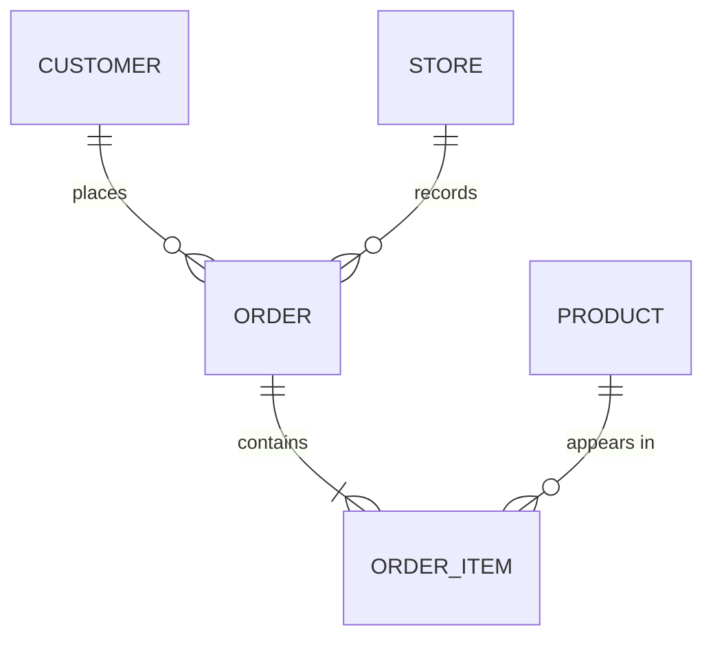
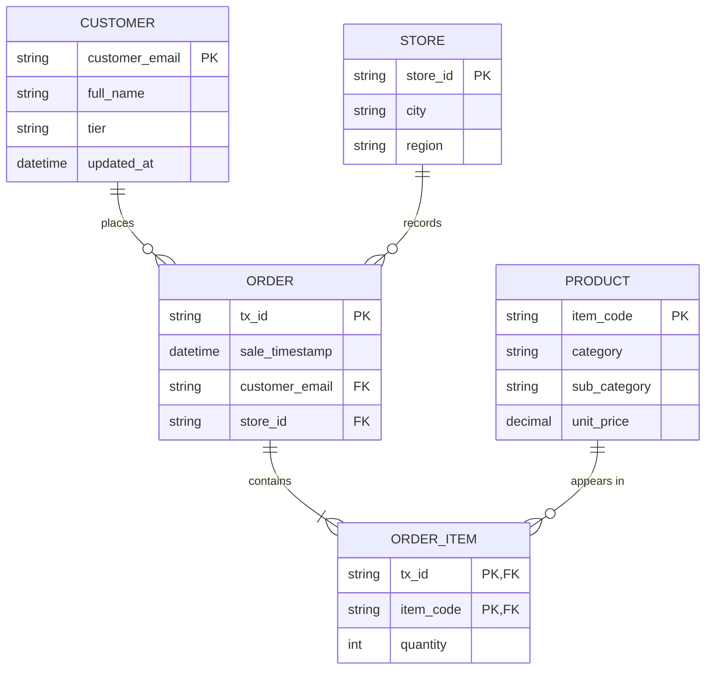
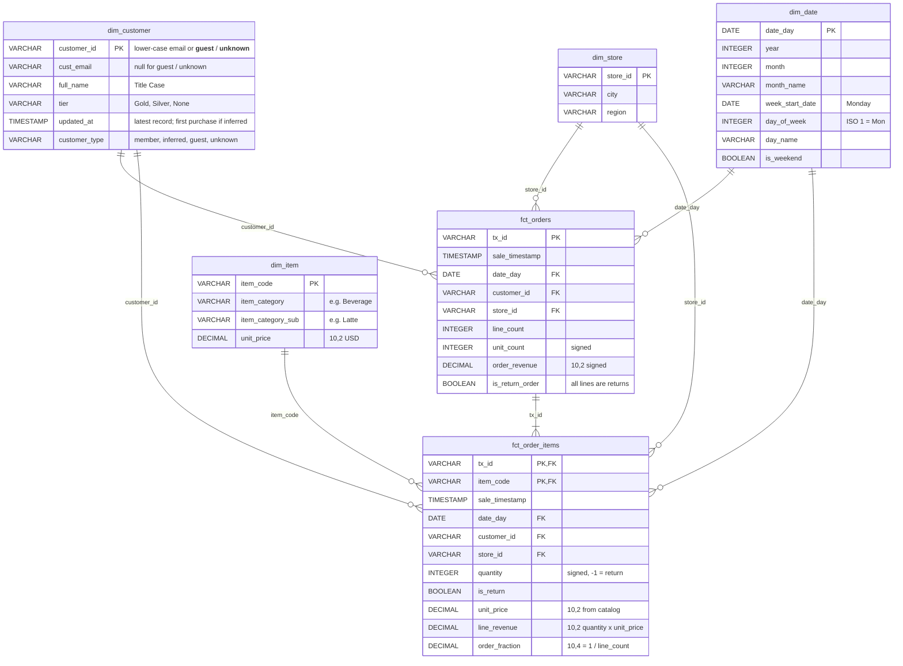

# The Daily Grind — Data Model (Task 1)

Source of decisions: [project_plan.md](project_plan.md).

## 1. Conceptual model

Business entities and how they relate. A Sale is recorded as an Order made of Order Items.

- A **Customer** places zero or more Orders. An Order has at most one identified customer; walk-ins are *Guest*, unreadable contacts are *Unknown*.
- A **Store** records zero or more Orders; every Order belongs to exactly one Store.
- An **Order** contains one or more **Order Items**. A return is an Order Item with negative quantity.
- A **Product** appears in zero or more Order Items (e.g. `UNKNOWN_ITEM` has never sold).

## 2. Logical model (normalised, 3NF)

Attributes and keys, independent of database. Fixes the source's 1NF breaks: the delimited `items_sold` string becomes `ORDER_ITEM` rows, and the `store_metadata` JSON becomes `STORE`.

## 3. Physical model — Kimball star schema (DuckDB, Gold layer)

Two facts at different grains share conformed dimensions.
`fct_orders` = one row per transaction; `fct_order_items` = one row per item per transaction.
`DECIMAL` precision is in the comment (Mermaid types cannot contain commas).

## 4. Design choices

| Choice | Why |
|---|---|
| Two facts (order + order item) | Order KPIs (orders, AOV) need one row per transaction; product performance needs line grain. Keeping both avoids double-counting orders when slicing by product. |
| `order_fraction` on line fact | Σ `order_fraction` per product = orders attributed to that product without double counting (split by line). |
| Signed `quantity` + `is_return` | Revenue sums are correct without filters; the flag still lets managers see returns separately. |
| `is_return_order` | Return-only transactions are excluded from order count and AOV but still reduce net revenue. |
| Dimension keys repeated on line fact | Power BI can filter product visuals by store, date and customer directly (star, not snowflake). |
| Latest record only in `dim_customer` | Brief says "we only want the latest"; history stays in Silver. |
| Guest / Unknown / inferred customers | Every sale joins to a customer, so no revenue disappears from joined visuals. |
| `unit_price` stored on the fact | Protects past revenue from future catalog price changes. |
| `dim_date` | Enables trend visuals and time intelligence in Power BI. |
