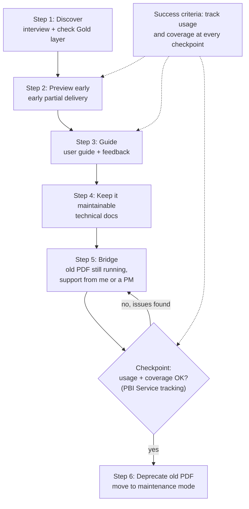

# Task 4 — Roll-out strategy

Store Managers currently get a static Excel export as a PDF in their inbox. The roll-out replaces this with the dashboard through an agile cycle, not a single hand-off. Before building, interview the Store Manager and check the Gold layer can support what they ask for, then deliver an early, partial dashboard so they can react and adjust requirements while changes are still cheap. As it nears production, hand over a user guide alongside technical documentation kept maintainable for the next person. At launch, run a bridging period alongside the old PDF, with me as the direct support contact in the first month (or a PM, if one sits between me and the Store Manager; in this project that role is hypothetical).

At each checkpoint, track dashboard usage and confirm coverage is acceptable across the 3 Store Managers in this demo's scope, not just early responders. A checkpoint showing low usage or uneven coverage means extending the bridging period, not moving ahead. In this demo the report stays local, so usage tracking here is illustrative; the actual version runs on Azure and the Power BI Service, where usage is trackable directly. Only once tracking shows real use does the old PDF get retired and the project move into maintenance mode, so the bridging period length stays flexible rather than a fixed date.

## Process and strategy diagram

