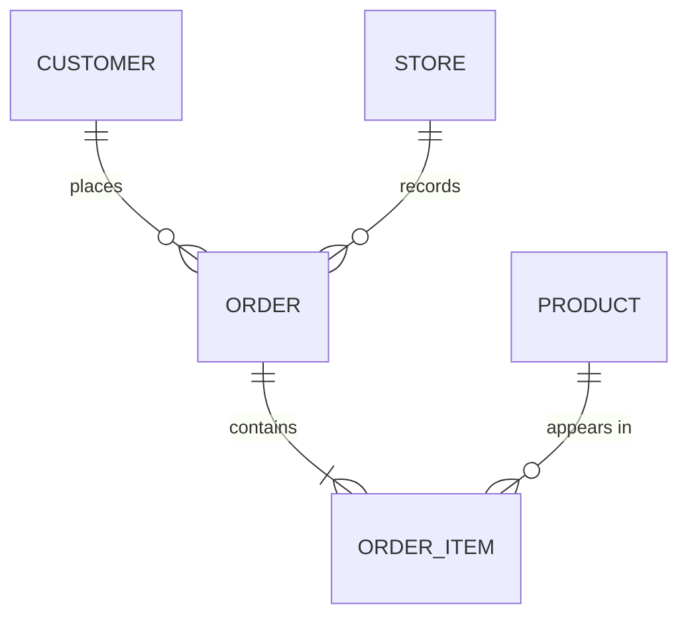
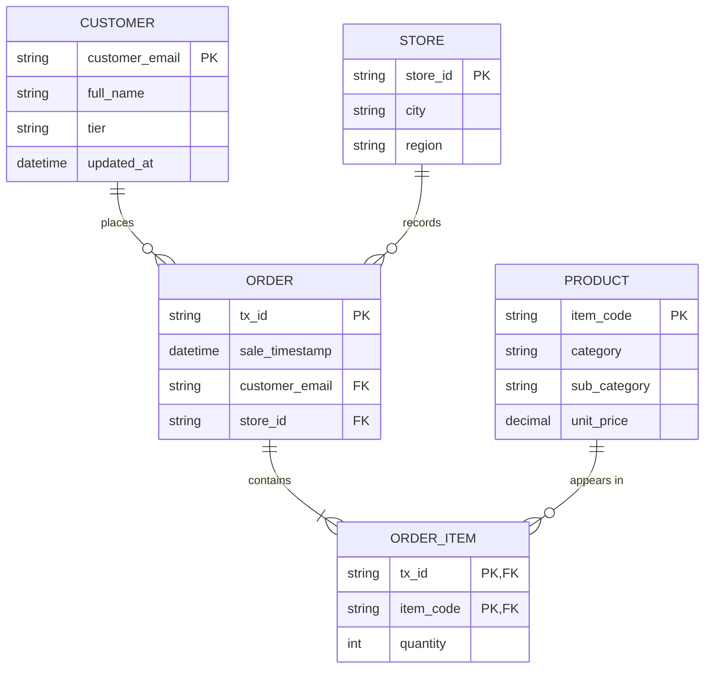
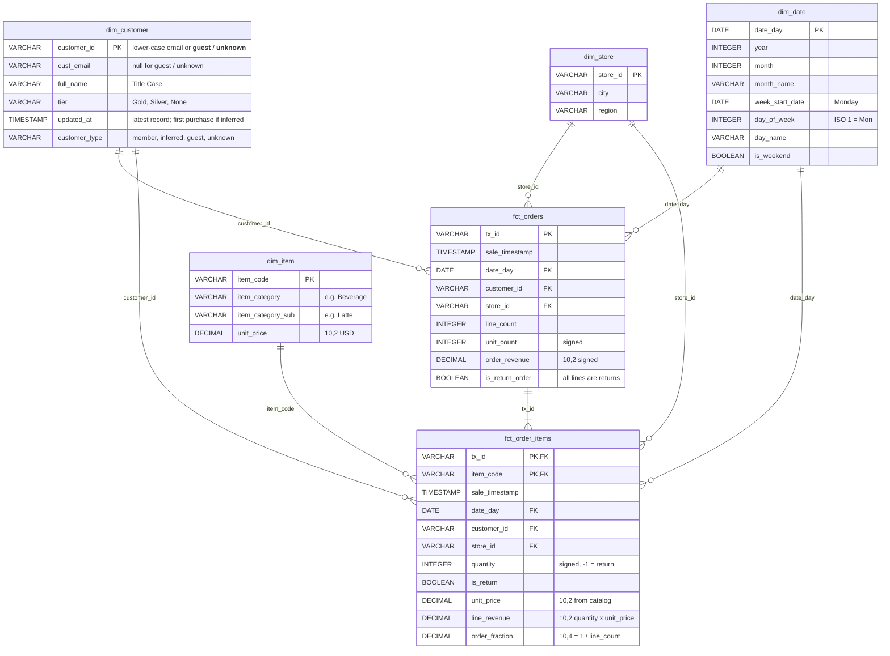

# Task 1 Blueprint (Data Modelling) Implementation Plan

> **For agentic workers:** REQUIRED SUB-SKILL: Use superpowers:subagent-driven-development (recommended) or superpowers:executing-plans to implement this plan task-by-task. Steps use checkbox (`- [ ]`) syntax for tracking.

**Goal:** Deliver `docs/erd.md` with the conceptual, logical and physical (Kimball star schema) models for The Daily Grind, as Mermaid ER diagrams with PKs, FKs and DuckDB data types.

**Architecture:** One Markdown file, three Mermaid `erDiagram` blocks (conceptual → logical → physical) plus short design-rationale text. Content is fixed by `docs/project_plan.md` §3, §5, §6. Syntax is validated by rendering with Mermaid CLI; content is validated by a script that compares every column in §6 against the physical diagram.

**Tech Stack:** Markdown, Mermaid `erDiagram`, `@mermaid-js/mermaid-cli` via `npx` (Node v24.19.0), Python 3.10 (Anaconda) for the column check.

## Global Constraints

- Source of truth: `docs/project_plan.md`. Do not change a confirmed decision; ask Albert instead.
- Branch: `feat/task1-erd` off `main`. Albert merges. Never commit to `main`.
- Physical types are DuckDB types: `VARCHAR`, `INTEGER`, `DECIMAL(10,2)`, `DECIMAL(10,4)`, `DATE`, `TIMESTAMP`, `BOOLEAN`.
- Mermaid attribute types cannot contain commas, so `DECIMAL(10,2)` is written as type `DECIMAL` with the precision in the quoted comment, e.g. `DECIMAL unit_price "10,2"`.
- Never commit rendered output (`target/`, `*.svg`).
- Working style (CLAUDE.md): "I don't know — stopping to ask" is acceptable; finish with a verification status where only tool calls count as verification.

## Model assignment

| Task | Model | Effort |
|---|---|---|
| Task 1: write `docs/erd.md` and validate | Sonnet 5 | low |
| Task 2: review against spec and brief | Opus 5 (orchestrator) | medium |

---

### Task 1: Write and validate `docs/erd.md`

**Files:**
- Create: `docs/erd.md`
- Create: `scripts/check_erd_columns.py`
- Modify: `.gitignore` (append `target/` and `*.svg`)

**Interfaces:**
- Consumes: `docs/project_plan.md` §6 tables (column names and types).
- Produces: `docs/erd.md` — Task 2 of the pipeline plan builds Gold models to exactly these table and column names.

- [ ] **Step 1: Create the branch**

```bash
git checkout main && git pull --ff-only && git checkout -b feat/task1-erd
```
Expected: `Switched to a new branch 'feat/task1-erd'`

- [ ] **Step 2: Write the failing column check**

Create `scripts/check_erd_columns.py`:

```python
"""Check that the physical ER diagram in docs/erd.md contains exactly the
tables/columns/types defined in docs/project_plan.md section 6."""
import re
import sys
from pathlib import Path

EXPECTED = {
    "dim_customer": {"customer_id": "VARCHAR", "cust_email": "VARCHAR", "full_name": "VARCHAR",
                     "tier": "VARCHAR", "updated_at": "TIMESTAMP", "customer_type": "VARCHAR"},
    "dim_item": {"item_code": "VARCHAR", "item_category": "VARCHAR",
                 "item_category_sub": "VARCHAR", "unit_price": "DECIMAL"},
    "dim_store": {"store_id": "VARCHAR", "city": "VARCHAR", "region": "VARCHAR"},
    "dim_date": {"date_day": "DATE", "year": "INTEGER", "month": "INTEGER", "month_name": "VARCHAR",
                 "week_start_date": "DATE", "day_of_week": "INTEGER", "day_name": "VARCHAR",
                 "is_weekend": "BOOLEAN"},
    "fct_orders": {"tx_id": "VARCHAR", "sale_timestamp": "TIMESTAMP", "date_day": "DATE",
                   "customer_id": "VARCHAR", "store_id": "VARCHAR", "line_count": "INTEGER",
                   "unit_count": "INTEGER", "order_revenue": "DECIMAL", "is_return_order": "BOOLEAN"},
    "fct_order_items": {"tx_id": "VARCHAR", "item_code": "VARCHAR", "sale_timestamp": "TIMESTAMP",
                        "date_day": "DATE", "customer_id": "VARCHAR", "store_id": "VARCHAR",
                        "quantity": "INTEGER", "is_return": "BOOLEAN", "unit_price": "DECIMAL",
                        "line_revenue": "DECIMAL", "order_fraction": "DECIMAL"},
}
EXPECTED_PK = {"dim_customer": {"customer_id"}, "dim_item": {"item_code"}, "dim_store": {"store_id"},
               "dim_date": {"date_day"}, "fct_orders": {"tx_id"},
               "fct_order_items": {"tx_id", "item_code"}}


def parse_physical(text: str) -> dict:
    section = text.split("## 3. Physical model", 1)
    if len(section) < 2:
        sys.exit("FAIL: heading '## 3. Physical model' not found")
    block = re.search(r"```mermaid\s*\nerDiagram(.*?)```", section[1], re.S)
    if not block:
        sys.exit("FAIL: no mermaid erDiagram in physical model section")
    tables = {}
    # Entity blocks only: "name {" alone on its line (relationship lines also contain "{").
    for name, body in re.findall(r"^\s*(\w+)\s*\{\s*$(.*?)^\s*\}\s*$", block.group(1), re.S | re.M):
        cols = {}
        for line in body.strip().splitlines():
            parts = line.split()
            if len(parts) < 2:
                continue
            keys = set(re.findall(r"\b(PK|FK)\b", line))
            cols[parts[1]] = {"type": parts[0], "keys": keys}
        tables[name] = cols
    return tables


def main() -> int:
    tables = parse_physical(Path("docs/erd.md").read_text(encoding="utf-8"))
    errors = []
    if set(tables) != set(EXPECTED):
        errors.append(f"tables differ: got {sorted(tables)} expected {sorted(EXPECTED)}")
    for t, cols in EXPECTED.items():
        got = tables.get(t, {})
        if list(got) != list(cols):
            errors.append(f"{t}: columns/order differ: got {list(got)} expected {list(cols)}")
        for c, typ in cols.items():
            if c in got and got[c]["type"] != typ:
                errors.append(f"{t}.{c}: type {got[c]['type']} expected {typ}")
        pks = {c for c, v in got.items() if "PK" in v["keys"]}
        if pks != EXPECTED_PK[t]:
            errors.append(f"{t}: PK {sorted(pks)} expected {sorted(EXPECTED_PK[t])}")
    for e in errors:
        print("FAIL:", e)
    print("PASS" if not errors else f"{len(errors)} error(s)")
    return 1 if errors else 0


if __name__ == "__main__":
    sys.exit(main())
```

- [ ] **Step 3: Run it to verify it fails**

Run: `"C:/Users/Albert Liu/anaconda3/python.exe" scripts/check_erd_columns.py`
Expected: exit 1 with a `FileNotFoundError` for `docs/erd.md`.

- [ ] **Step 4: Write `docs/erd.md`**

Create `docs/erd.md` with exactly this content:

````markdown
# The Daily Grind — Data Model (Task 1)

Source of decisions: [project_plan.md](project_plan.md).

## 1. Conceptual model

Business entities and how they relate. A Sale is recorded as an Order made of Order Items.



- A **Customer** places zero or more Orders. An Order has at most one identified customer; walk-ins are *Guest*, unreadable contacts are *Unknown*.
- A **Store** records zero or more Orders; every Order belongs to exactly one Store.
- An **Order** contains one or more **Order Items**. A return is an Order Item with negative quantity.
- A **Product** appears in zero or more Order Items (e.g. `UNKNOWN_ITEM` has never sold).

## 2. Logical model (normalised, 3NF)

Attributes and keys, independent of database. Fixes the source's 1NF breaks: the delimited `items_sold` string becomes `ORDER_ITEM` rows, and the `store_metadata` JSON becomes `STORE`.



## 3. Physical model — Kimball star schema (DuckDB, Gold layer)

Two facts at different grains share conformed dimensions.
`fct_orders` = one row per transaction; `fct_order_items` = one row per item per transaction.
`DECIMAL` precision is in the comment (Mermaid types cannot contain commas).



## 4. Design choices

| Choice | Why |
|---|---|
| Two facts (order + order item) | Order KPIs (orders, AOV) need one row per transaction; product performance needs line grain. Keeping both avoids double-counting orders when slicing by product. |
| `order_fraction` on line fact | Σ `order_fraction` per product = orders attributed to that product without double counting (split by line). |
| Signed `quantity` + `is_return` | Revenue sums are correct without filters; the flag still lets managers see returns separately. |
| `is_return_order` | Return-only transactions are excluded from order count and AOV but still reduce net revenue. |
| Dimension keys repeated on line fact | Power BI can filter product visuals by store, date and customer directly (star, not snowflake). |
| Latest record only in `dim_customer` | Brief says "we only want the latest"; history stays in Silver. |
| Guest / Unknown / inferred customers | Every sale joins to a customer, so no revenue disappears from joined visuals. |
| `unit_price` stored on the fact | Protects past revenue from future catalog price changes. |
| `dim_date` | Enables trend visuals and time intelligence in Power BI. |
````

- [ ] **Step 5: Run the column check to verify it passes**

Run: `"C:/Users/Albert Liu/anaconda3/python.exe" scripts/check_erd_columns.py`
Expected: `PASS`, exit 0.

- [ ] **Step 6: Render all three diagrams to validate Mermaid syntax**

Run: `mkdir -p target && npx -y @mermaid-js/mermaid-cli@11 -i docs/erd.md -o target/erd.md`
(The output directory must exist first; mmdc fails with `Output directory "target/" doesn't exist` otherwise.)
Expected: `Found 3 mermaid charts in Markdown input` and `✅` for `erd-1.svg`, `erd-2.svg`, `erd-3.svg`; no parse error. If a diagram fails to parse, report the exact error line and stop — do not change table or column names to work around it.

- [ ] **Step 7: Ignore rendered output**

Append to `.gitignore`:
```
target/
*.svg
```
Run: `git status --short`
Expected: only `.gitignore`, `docs/erd.md`, `scripts/check_erd_columns.py` shown (plus this plan file if not yet committed).

- [ ] **Step 8: Commit**

```bash
git add .gitignore docs/erd.md scripts/check_erd_columns.py docs/superpowers/plans/task1-blueprint.md
git commit -m "docs: add Task 1 conceptual, logical and physical data model

Co-Authored-By: Claude Opus 5 <noreply@anthropic.com>"
```

---

### Task 2: Review against spec and brief (Opus 5, medium)

**Files:** none modified unless a finding is accepted by Albert.

- [ ] **Step 1:** Re-run `scripts/check_erd_columns.py` and the Mermaid render myself (do not trust the subagent report).
- [ ] **Step 2:** Open `target/erd-3.svg` and confirm every relationship line and PK/FK marker appears.
- [ ] **Step 3:** Check brief coverage: entities Sales, Customers, Products, Stores present; star schema with facts and dims; PK/FK and data types shown.
- [ ] **Step 4:** Push `feat/task1-erd` and report to Albert with a verification status; Albert opens and merges the PR and confirms GitHub renders the diagrams.
